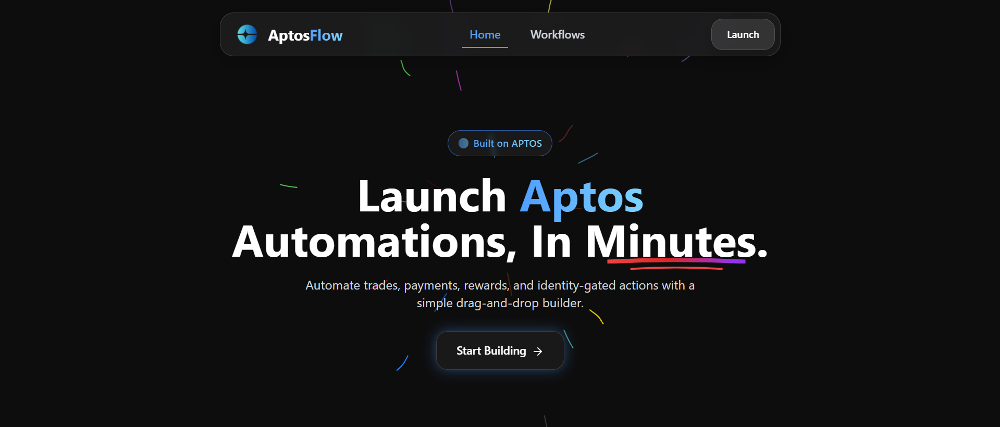
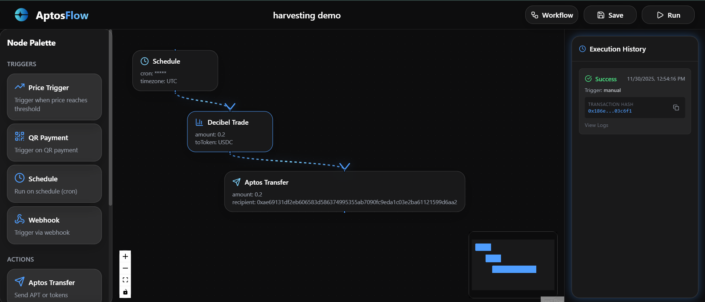

# AptosFlow – Smart Money Automation Builder

A no-code workflow builder for automating DeFi trading, payments, and rewards on Aptos blockchain. Built with Next.js 15, React Flow, and Supabase.

## Screenshots


*Beautiful landing page with glassmorphism effects and smooth animations*


*Drag-and-drop workflow builder with visual node connections*


*Real-time workflow execution monitoring and management*

## Features

- 🎨 **Beautiful UI**: Dark theme with glassmorphism effects, smooth animations, and floating navbar
- 🔧 **No-Code Builder**: Drag-and-drop workflow builder using React Flow
- 🔗 **DeFi Integrations**: 
  - Photon SDK for identity and rewards
  - Decibel for trading
  - Aptos SDK for transfers and transactions
- 📊 **Real-time Updates**: Supabase Realtime for workflow execution status
- 🚀 **Workflow Types**: 
  - Price triggers
  - Aptos transfers
  - Decibel trades
  - Photon reward events
  - QR payment triggers
  - Scheduled workflows (cron)
  - Conditional logic
  - Webhook triggers

## Tech Stack

- **Frontend**: Next.js 15 (App Router), TypeScript, Tailwind CSS, React Flow, Framer Motion, Zustand
- **Backend**: Supabase (auth, database, edge functions, realtime)
- **Blockchain**: Aptos TypeScript SDK, Photon SDK, Decibel API

## Getting Started

### Prerequisites

- Node.js 20.9.0 or higher
- npm or yarn
- Supabase account
- (Optional) Photon SDK credentials
- (Optional) Decibel API key

### Installation

1. Clone the repository:
```bash
git clone <your-repo-url>
cd aptos-flow
```

2. Install dependencies:
```bash
npm install
```

3. Set up environment variables:
```bash
cp .env.example .env.local
```

Edit `.env.local` with your credentials:
- `NEXT_PUBLIC_SUPABASE_URL`: Your Supabase project URL
- `NEXT_PUBLIC_SUPABASE_ANON_KEY`: Your Supabase anon key
- `NEXT_PUBLIC_PHOTON_API_KEY`: Your Photon API key (optional, uses API Key not Client ID)
- `APTOS_NETWORK`: Network to use (testnet/mainnet/devnet)
- `DECIBEL_API_KEY`: Your Decibel API key (optional)

4. Set up Supabase database:

Run these SQL commands in your Supabase SQL editor:

```sql
-- Users table
CREATE TABLE users (
  id UUID PRIMARY KEY DEFAULT gen_random_uuid(),
  photon_id TEXT,
  wallet_address TEXT,
  created_at TIMESTAMP WITH TIME ZONE DEFAULT NOW()
);

-- Workflows table
CREATE TABLE workflows (
  id UUID PRIMARY KEY DEFAULT gen_random_uuid(),
  user_id UUID REFERENCES users(id) ON DELETE CASCADE,
  name TEXT NOT NULL,
  description TEXT,
  json_definition JSONB NOT NULL,
  is_active BOOLEAN DEFAULT false,
  created_at TIMESTAMP WITH TIME ZONE DEFAULT NOW()
);

-- Workflow runs table
CREATE TABLE workflow_runs (
  id UUID PRIMARY KEY DEFAULT gen_random_uuid(),
  workflow_id UUID REFERENCES workflows(id) ON DELETE CASCADE,
  status TEXT NOT NULL CHECK (status IN ('pending', 'running', 'completed', 'failed')),
  logs TEXT,
  trigger_type TEXT,
  executed_at TIMESTAMP WITH TIME ZONE DEFAULT NOW()
);

-- Enable Row Level Security
ALTER TABLE users ENABLE ROW LEVEL SECURITY;
ALTER TABLE workflows ENABLE ROW LEVEL SECURITY;
ALTER TABLE workflow_runs ENABLE ROW LEVEL SECURITY;

-- Policies (adjust as needed for your auth setup)
CREATE POLICY "Users can view own data" ON users FOR SELECT USING (auth.uid() = id);
CREATE POLICY "Users can view own workflows" ON workflows FOR SELECT USING (auth.uid() = user_id);
CREATE POLICY "Users can create own workflows" ON workflows FOR INSERT WITH CHECK (auth.uid() = user_id);
CREATE POLICY "Users can update own workflows" ON workflows FOR UPDATE USING (auth.uid() = user_id);
CREATE POLICY "Users can view own workflow runs" ON workflow_runs FOR SELECT USING (
  EXISTS (SELECT 1 FROM workflows WHERE workflows.id = workflow_runs.workflow_id AND workflows.user_id = auth.uid())
);
```

5. Run the development server:
```bash
npm run dev
```

6. Open [http://localhost:3000](http://localhost:3000) in your browser.

## Project Structure

```
aptos-flow/
├── app/                    # Next.js App Router pages
│   ├── page.tsx           # Landing page
│   ├── dashboard/         # Dashboard page
│   ├── builder/[id]/      # Workflow builder page
│   └── auth/              # Authentication page
├── components/
│   ├── ui/                # Reusable UI components
│   ├── layout/            # Layout components (Navbar)
│   └── workflow/          # Workflow builder components
├── lib/                   # Utility functions and clients
│   ├── supabase.ts       # Supabase client
│   ├── aptos.ts          # Aptos SDK client
│   └── utils.ts          # Utility functions
├── stores/                # Zustand state management
│   ├── workflow-store.ts # Workflow state
│   └── auth-store.ts     # Auth state
└── types/                 # TypeScript type definitions
```

## Usage

### Creating a Workflow

1. Navigate to the Dashboard
2. Click "New Workflow"
3. Drag nodes from the sidebar onto the canvas
4. Connect nodes by dragging from output handles to input handles
5. Click on a node to configure it
6. Save your workflow

### Node Types

- **Triggers**: Price Trigger, QR Payment, Schedule, Webhook
- **Actions**: Aptos Transfer, Decibel Trade, Photon Reward
- **Logic**: Conditional Logic

### Running Workflows

- Click "Run" in the workflow builder to execute manually
- Active workflows can be triggered automatically based on their trigger type
- View execution logs in the right sidebar

## Deployment

### Vercel (Recommended)

1. Push your code to GitHub
2. Import your repository in Vercel
3. Add environment variables in Vercel dashboard
4. Deploy

### Supabase Edge Functions

For workflow execution, you'll need to set up Supabase Edge Functions. See the `supabase/functions` directory (to be created) for examples.

## Environment Variables

See `.env.example` for all required environment variables.

## Contributing

Contributions are welcome! Please feel free to submit a Pull Request.

## License

MIT

## Support

For issues and questions, please open an issue on GitHub.
